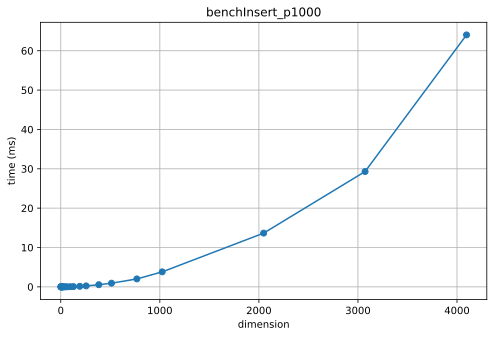
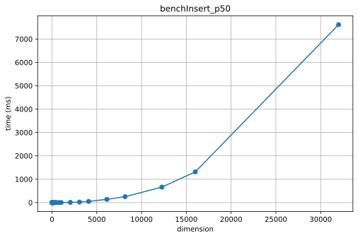
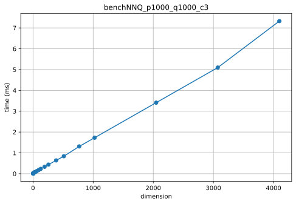
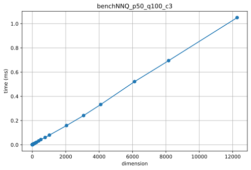
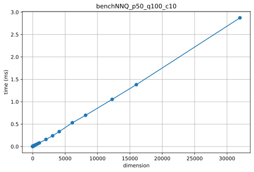
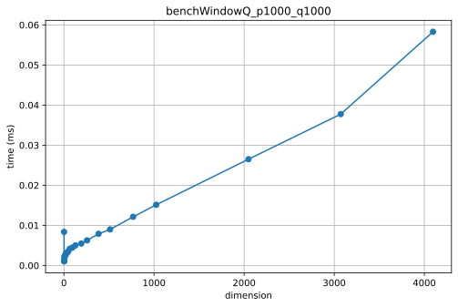
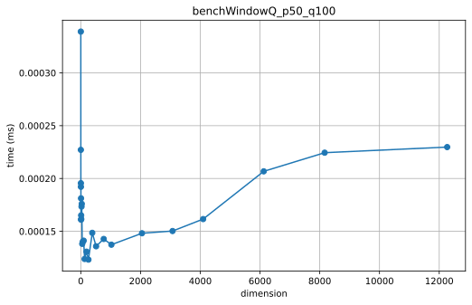

# Benchmarks

Везде B = 10, коэффициент минимального количество детей вершины 0.4

## Inserts

1000 точек

50 точек

## NNQ

1000 точек, поиск 3 ближайших соседей, усреднение по 1000 запросам

100 точек, поиск 3 ближайших соседей, усреднение по 100 запросам

100 точек, поиск 10 ближайших соседей, усреднение по 100 запросам

## WindowQ

1000 точек, усреднение по 1000 запросам

50 точек, усреднение по 100 запросам (усреднение, видимо, слишком маленькое) 

